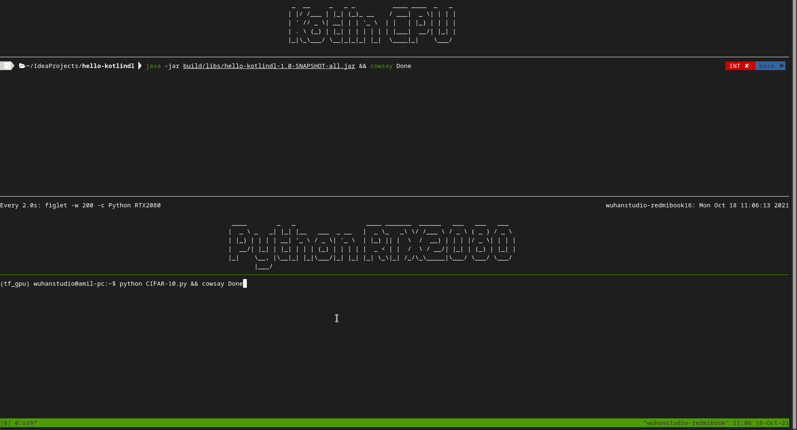

# KotlinDL-mnist

> KotlinDL: Deep Learning Framework written in Kotlin

This project trains a dense neural network using both KotlinDL and Python3 on the mnist dataset.

The test result is intriguing: KotlinDL on a i5 CPU (without AVX) is **2x faster** than Python on a RTX2080 GPU.

|          | Framework (CUDA 10.0 + cudnn 7.6.5) | Device           | Time (s) | Accuracy |
| -------- | ----------------------------------- | ---------------- | -------- | -------- |
| Python   | Tensorflow                          | GPU (RTX 2080)   | 90.90    | 89%      |
| Python   | Tensorflow                          | CPU (i5-1035G1)  | 75.28    | 88%      |
| KotlinDL | KotlinDL                            | CPU (i5-1035G1 ) | 44.88    | 98%      |



## Quick-Start

### Kotkin

1. Import the project into Intellij Idea IDE

2. Run `main.kt` or build a JAR file:

```
$ ./gradlew shadowJar 
$ java -jar build/libs/hello-kotlindl-1.0-SNAPSHOT-all.jar 
```

Outputs:

```
Extracting 60000 images of 28x28 from /home/wuhanstudio/kotlndl-mnist/cache/datasets/mnist/train-images-idx3-ubyte.gz
Extracting 60000 labels from /home/wuhanstudio/kotlndl-mnist/cache/datasets/mnist/train-labels-idx1-ubyte.gz
Extracting 10000 images of 28x28 from /home/wuhanstudio/kotlndl-mnist/cache/datasets/mnist/t10k-images-idx3-ubyte.gz
Extracting 10000 labels from /home/wuhanstudio/kotlndl-mnist/cache/datasets/mnist/t10k-labels-idx1-ubyte.gz
2021-10-18 11:36:13.974410: I tensorflow/core/platform/cpu_feature_guard.cc:142] Your CPU supports instructions that this TensorFlow binary was not compiled to use: AVX2 AVX512F FMA
2021-10-18 11:36:13.991707: I tensorflow/core/platform/profile_utils/cpu_utils.cc:94] CPU Frequency: 1190500000 Hz
2021-10-18 11:36:13.992207: I tensorflow/compiler/xla/service/service.cc:168] XLA service 0x7f1d7d234db0 initialized for platform Host (this does not guarantee that XLA will be used). Devices:
2021-10-18 11:36:13.992244: I tensorflow/compiler/xla/service/service.cc:176]   StreamExecutor device (0): Host, Default Version
[main] INFO org.jetbrains.kotlinx.dl.api.core.GraphTrainableModel - ===========================================================================
[main] INFO org.jetbrains.kotlinx.dl.api.core.GraphTrainableModel - Model: Sequential
[main] INFO org.jetbrains.kotlinx.dl.api.core.GraphTrainableModel - ___________________________________________________________________________
[main] INFO org.jetbrains.kotlinx.dl.api.core.GraphTrainableModel - Layer (type)                           Output Shape              Param #   
[main] INFO org.jetbrains.kotlinx.dl.api.core.GraphTrainableModel - ===========================================================================
[main] INFO org.jetbrains.kotlinx.dl.api.core.GraphTrainableModel - input_1(Input)                         [None, 28, 28, 1]         0
[main] INFO org.jetbrains.kotlinx.dl.api.core.GraphTrainableModel - ___________________________________________________________________________
[main] INFO org.jetbrains.kotlinx.dl.api.core.GraphTrainableModel - flatten_2(Flatten)                     [None, 784]               0
[main] INFO org.jetbrains.kotlinx.dl.api.core.GraphTrainableModel - ___________________________________________________________________________
[main] INFO org.jetbrains.kotlinx.dl.api.core.GraphTrainableModel - dense_3(Dense)                         [None, 256]               200960
[main] INFO org.jetbrains.kotlinx.dl.api.core.GraphTrainableModel - ___________________________________________________________________________
[main] INFO org.jetbrains.kotlinx.dl.api.core.GraphTrainableModel - dense_4(Dense)                         [None, 128]               32896
[main] INFO org.jetbrains.kotlinx.dl.api.core.GraphTrainableModel - ___________________________________________________________________________
[main] INFO org.jetbrains.kotlinx.dl.api.core.GraphTrainableModel - dense_5(Dense)                         [None, 10]                1290
[main] INFO org.jetbrains.kotlinx.dl.api.core.GraphTrainableModel - ___________________________________________________________________________
[main] INFO org.jetbrains.kotlinx.dl.api.core.GraphTrainableModel - ===========================================================================
[main] INFO org.jetbrains.kotlinx.dl.api.core.GraphTrainableModel - Total trainable params: 235146
[main] INFO org.jetbrains.kotlinx.dl.api.core.GraphTrainableModel - Total frozen params: 0
[main] INFO org.jetbrains.kotlinx.dl.api.core.GraphTrainableModel - Total params: 235146
[main] INFO org.jetbrains.kotlinx.dl.api.core.GraphTrainableModel - ===========================================================================
[main] INFO org.jetbrains.kotlinx.dl.api.core.GraphTrainableModel - epochs: 1 loss: 1.5531934 metric: 0.91681665
[main] INFO org.jetbrains.kotlinx.dl.api.core.GraphTrainableModel - epochs: 2 loss: 1.5114808 metric: 0.95426667
[main] INFO org.jetbrains.kotlinx.dl.api.core.GraphTrainableModel - epochs: 3 loss: 1.5006521 metric: 0.96405
[main] INFO org.jetbrains.kotlinx.dl.api.core.GraphTrainableModel - epochs: 4 loss: 1.4932657 metric: 0.97105
[main] INFO org.jetbrains.kotlinx.dl.api.core.GraphTrainableModel - epochs: 5 loss: 1.4879782 metric: 0.97581667
[main] INFO org.jetbrains.kotlinx.dl.api.core.GraphTrainableModel - epochs: 6 loss: 1.4843937 metric: 0.97915
[main] INFO org.jetbrains.kotlinx.dl.api.core.GraphTrainableModel - epochs: 7 loss: 1.4815989 metric: 0.98175
[main] INFO org.jetbrains.kotlinx.dl.api.core.GraphTrainableModel - epochs: 8 loss: 1.479125 metric: 0.98373336
[main] INFO org.jetbrains.kotlinx.dl.api.core.GraphTrainableModel - epochs: 9 loss: 1.4773757 metric: 0.9853
[main] INFO org.jetbrains.kotlinx.dl.api.core.GraphTrainableModel - epochs: 10 loss: 1.4757954 metric: 0.9867333
EvaluationResult(lossValue=1.4855552911758423, metrics={ACCURACY=0.97607421875})

```


### Python


```
$ python python/mnist.py
```

Outputs:

```
2021-10-18 10:58:21.579529: I tensorflow/stream_executor/platform/default/dso_loader.cc:44] Successfully opened dynamic library libcuda.so.1
2021-10-18 10:58:21.585691: I tensorflow/core/common_runtime/gpu/gpu_device.cc:1561] Found device 0 with properties: 
pciBusID: 0000:1a:00.0 name: GeForce RTX 2080 Ti computeCapability: 7.5
coreClock: 1.545GHz coreCount: 68 deviceMemorySize: 10.76GiB deviceMemoryBandwidth: 573.69GiB/s
2021-10-18 10:58:21.586119: I tensorflow/core/common_runtime/gpu/gpu_device.cc:1561] Found device 1 with properties: 
pciBusID: 0000:68:00.0 name: GeForce RTX 2080 Ti computeCapability: 7.5
coreClock: 1.545GHz coreCount: 68 deviceMemorySize: 10.76GiB deviceMemoryBandwidth: 573.69GiB/s
2021-10-18 10:58:21.586272: I tensorflow/stream_executor/platform/default/dso_loader.cc:44] Successfully opened dynamic library libcudart.so.10.1
2021-10-18 10:58:21.587325: I tensorflow/stream_executor/platform/default/dso_loader.cc:44] Successfully opened dynamic library libcublas.so.10
2021-10-18 10:58:21.588445: I tensorflow/stream_executor/platform/default/dso_loader.cc:44] Successfully opened dynamic library libcufft.so.10
2021-10-18 10:58:21.588666: I tensorflow/stream_executor/platform/default/dso_loader.cc:44] Successfully opened dynamic library libcurand.so.10
2021-10-18 10:58:21.589871: I tensorflow/stream_executor/platform/default/dso_loader.cc:44] Successfully opened dynamic library libcusolver.so.10
2021-10-18 10:58:21.590520: I tensorflow/stream_executor/platform/default/dso_loader.cc:44] Successfully opened dynamic library libcusparse.so.10
2021-10-18 10:58:21.593104: I tensorflow/stream_executor/platform/default/dso_loader.cc:44] Successfully opened dynamic library libcudnn.so.7
2021-10-18 10:58:21.594470: I tensorflow/core/common_runtime/gpu/gpu_device.cc:1703] Adding visible gpu devices: 0, 1
2021-10-18 10:58:21.594647: I tensorflow/core/platform/cpu_feature_guard.cc:143] Your CPU supports instructions that this TensorFlow binary was not compiled to use: AVX2 AVX512F FMA
2021-10-18 10:58:21.599731: I tensorflow/core/platform/profile_utils/cpu_utils.cc:102] CPU Frequency: 3699850000 Hz
2021-10-18 10:58:21.600265: I tensorflow/compiler/xla/service/service.cc:168] XLA service 0x7fb000000b20 initialized for platform Host (this does not guarantee that XLA will be used). Devices:
2021-10-18 10:58:21.600279: I tensorflow/compiler/xla/service/service.cc:176]   StreamExecutor device (0): Host, Default Version
2021-10-18 10:58:21.895407: I tensorflow/compiler/xla/service/service.cc:168] XLA service 0x56097c3007e0 initialized for platform CUDA (this does not guarantee that XLA will be used). Devices:
2021-10-18 10:58:21.895430: I tensorflow/compiler/xla/service/service.cc:176]   StreamExecutor device (0): GeForce RTX 2080 Ti, Compute Capability 7.5
2021-10-18 10:58:21.895435: I tensorflow/compiler/xla/service/service.cc:176]   StreamExecutor device (1): GeForce RTX 2080 Ti, Compute Capability 7.5
2021-10-18 10:58:21.895962: I tensorflow/core/common_runtime/gpu/gpu_device.cc:1561] Found device 0 with properties: 
pciBusID: 0000:1a:00.0 name: GeForce RTX 2080 Ti computeCapability: 7.5
coreClock: 1.545GHz coreCount: 68 deviceMemorySize: 10.76GiB deviceMemoryBandwidth: 573.69GiB/s
2021-10-18 10:58:21.896369: I tensorflow/core/common_runtime/gpu/gpu_device.cc:1561] Found device 1 with properties: 
pciBusID: 0000:68:00.0 name: GeForce RTX 2080 Ti computeCapability: 7.5
coreClock: 1.545GHz coreCount: 68 deviceMemorySize: 10.76GiB deviceMemoryBandwidth: 573.69GiB/s
2021-10-18 10:58:21.896406: I tensorflow/stream_executor/platform/default/dso_loader.cc:44] Successfully opened dynamic library libcudart.so.10.1
2021-10-18 10:58:21.896415: I tensorflow/stream_executor/platform/default/dso_loader.cc:44] Successfully opened dynamic library libcublas.so.10
2021-10-18 10:58:21.896426: I tensorflow/stream_executor/platform/default/dso_loader.cc:44] Successfully opened dynamic library libcufft.so.10
2021-10-18 10:58:21.896436: I tensorflow/stream_executor/platform/default/dso_loader.cc:44] Successfully opened dynamic library libcurand.so.10
2021-10-18 10:58:21.896444: I tensorflow/stream_executor/platform/default/dso_loader.cc:44] Successfully opened dynamic library libcusolver.so.10
2021-10-18 10:58:21.896452: I tensorflow/stream_executor/platform/default/dso_loader.cc:44] Successfully opened dynamic library libcusparse.so.10
2021-10-18 10:58:21.896460: I tensorflow/stream_executor/platform/default/dso_loader.cc:44] Successfully opened dynamic library libcudnn.so.7
2021-10-18 10:58:21.897642: I tensorflow/core/common_runtime/gpu/gpu_device.cc:1703] Adding visible gpu devices: 0, 1
2021-10-18 10:58:21.897671: I tensorflow/stream_executor/platform/default/dso_loader.cc:44] Successfully opened dynamic library libcudart.so.10.1
2021-10-18 10:58:21.898686: I tensorflow/core/common_runtime/gpu/gpu_device.cc:1102] Device interconnect StreamExecutor with strength 1 edge matrix:
2021-10-18 10:58:21.898696: I tensorflow/core/common_runtime/gpu/gpu_device.cc:1108]      0 1 
2021-10-18 10:58:21.898702: I tensorflow/core/common_runtime/gpu/gpu_device.cc:1121] 0:   N N 
2021-10-18 10:58:21.898706: I tensorflow/core/common_runtime/gpu/gpu_device.cc:1121] 1:   N N 
2021-10-18 10:58:21.899649: I tensorflow/core/common_runtime/gpu/gpu_device.cc:1247] Created TensorFlow device (/job:localhost/replica:0/task:0/device:GPU:0 with 148 MB memory) -> physical GPU (device: 0, name: GeForce RTX 2080 Ti, pci bus id: 0000:1a:00.0, compute capability: 7.5)
2021-10-18 10:58:21.900536: I tensorflow/core/common_runtime/gpu/gpu_device.cc:1247] Created TensorFlow device (/job:localhost/replica:0/task:0/device:GPU:1 with 10184 MB memory) -> physical GPU (device: 1, name: GeForce RTX 2080 Ti, pci bus id: 0000:68:00.0, compute capability: 7.5)
Model: "sequential"
_________________________________________________________________
Layer (type)                 Output Shape              Param #   
=================================================================
flatten (Flatten)            (None, 784)               0         
_________________________________________________________________
dense (Dense)                (None, 256)               200960    
_________________________________________________________________
dense_1 (Dense)              (None, 128)               32896     
_________________________________________________________________
dense_2 (Dense)              (None, 10)                1290      
=================================================================
Total params: 235,146
Trainable params: 235,146
Non-trainable params: 0
_________________________________________________________________
Epoch 1/10
2021-10-18 10:58:22.667553: I tensorflow/stream_executor/platform/default/dso_loader.cc:44] Successfully opened dynamic library libcublas.so.10
1875/1875 [==============================] - 6s 3ms/step - loss: 1.5839 - accuracy: 0.8797 - val_loss: 1.5560 - val_accuracy: 0.9050
Epoch 2/10
1875/1875 [==============================] - 6s 3ms/step - loss: 1.5712 - accuracy: 0.8896 - val_loss: 1.5731 - val_accuracy: 0.8872
Epoch 3/10
1875/1875 [==============================] - 6s 3ms/step - loss: 1.5696 - accuracy: 0.8910 - val_loss: 1.5977 - val_accuracy: 0.8635
Epoch 4/10
1875/1875 [==============================] - 6s 3ms/step - loss: 1.5702 - accuracy: 0.8905 - val_loss: 1.5692 - val_accuracy: 0.8915
Epoch 5/10
1875/1875 [==============================] - 6s 3ms/step - loss: 1.5738 - accuracy: 0.8872 - val_loss: 1.5686 - val_accuracy: 0.8921
Epoch 6/10
1875/1875 [==============================] - 6s 3ms/step - loss: 1.5667 - accuracy: 0.8943 - val_loss: 1.5547 - val_accuracy: 0.9061
Epoch 7/10
1875/1875 [==============================] - 5s 3ms/step - loss: 1.5681 - accuracy: 0.8929 - val_loss: 1.5700 - val_accuracy: 0.8907
Epoch 8/10
1875/1875 [==============================] - 6s 3ms/step - loss: 1.5694 - accuracy: 0.8915 - val_loss: 1.5717 - val_accuracy: 0.8891
Epoch 9/10
1875/1875 [==============================] - 5s 3ms/step - loss: 1.5708 - accuracy: 0.8902 - val_loss: 1.6057 - val_accuracy: 0.8553
Epoch 10/10
1875/1875 [==============================] - 6s 3ms/step - loss: 1.5722 - accuracy: 0.8887 - val_loss: 1.5660 - val_accuracy: 0.8951
313/313 - 1s - loss: 1.5660 - accuracy: 0.8951
0.8950999975204468
```
